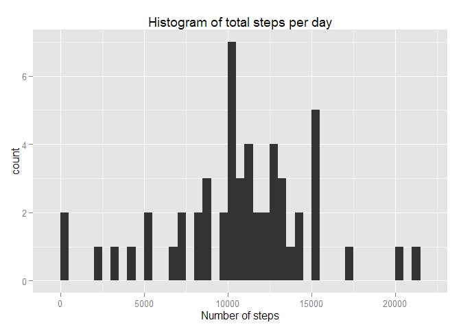
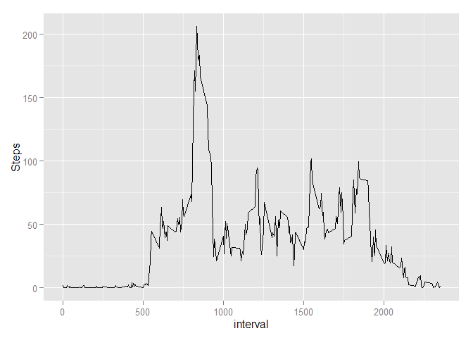
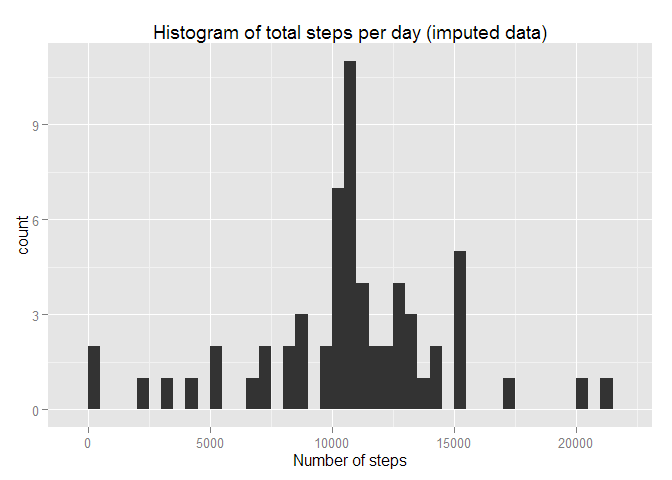
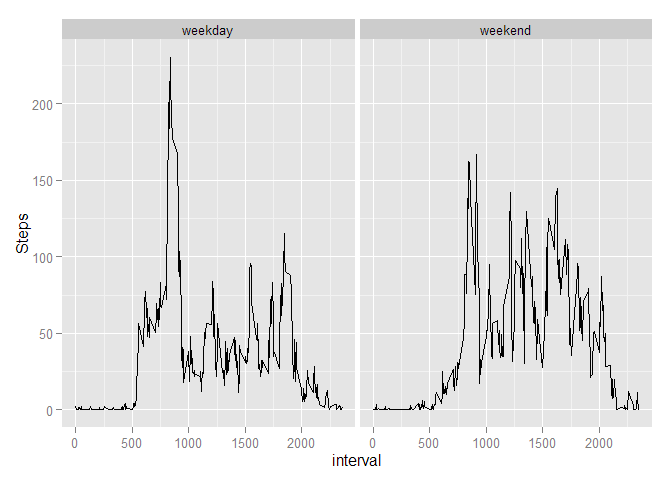

# Reproducible Research: Peer Assessment 1


## Loading and preprocessing the data
We will use dplyr package for manipulations with data and ggplot2 package for plotting. Also the locale is set to English.

```r
Sys.setlocale(locale="English")
```

```
## [1] "LC_COLLATE=English_United States.1252;LC_CTYPE=English_United States.1252;LC_MONETARY=English_United States.1252;LC_NUMERIC=C;LC_TIME=English_United States.1252"
```

```r
library(dplyr)
library(ggplot2)
```

Now we will prepare the data for producing the plots. We basically group the data by dates and intervals and we then average across these variables. In the end we have two prepared data sets.

```r
df <- read.csv("activity.csv")
df$date <- as.POSIXct(df$date)

df_by_date <- group_by(df, date)
df_by_interval <- group_by(df, interval)

df_summarized_by_date <- 
  summarize(df_by_date, 
            total_steps = sum(steps), 
            day_mean = mean(steps, na.rm = TRUE), 
            day_median = median(steps, na.rm = TRUE))

df_summarized_by_interval <- 
  summarize(df_by_interval, 
            avg_steps = mean(steps, na.rm = TRUE))
```


## What is mean total number of steps taken per day?

```r
steps_mean <- as.integer(mean(df_summarized_by_date$total_steps, na.rm = T))
steps_median <- as.integer(median(df_summarized_by_date$total_steps, na.rm = T))
```

The mean number of steps taken per day is 10766 and the median is 10765


```r
qplot(df_summarized_by_date$total_steps, binwidth = 500, xlab = "Number of steps", main = "Histogram of total steps per day")
```

 

## What is the average daily activity pattern?

```r
qplot(interval, avg_steps, data = df_summarized_by_interval, geom = "line", ylab = "Steps")
```

 


```r
max_steps <- max(df_summarized_by_interval$avg_steps)
max_steps_interval <- df_summarized_by_interval[
  df_summarized_by_interval$avg_steps == max_steps, 1]
```

The interval with the highest number of steps averaged accross the days is 835.

## Imputing missing values

```r
num_of_nas <- length(which(is.na(df$steps)))
```
  
The dataset contains 2304 NAs.

Now we will substitute the NAs with an average number of steps for the corresponding interval and save the result as new data frame. *This strategy was suggested in the assignement instructions.* We also do some aggregation and calculate the new means and medians for the new dataset.


```r
df_new <- df
na_inds <- which(is.na(df$steps))
for (i in seq(length(na_inds))) {
  ind <- na_inds[[i]]
  df_new[ind,1] <- df_summarized_by_interval[df_summarized_by_interval$interval == df[ind,3], 2]
}

df_new_by_date <- group_by(df_new, date)

df_new_summarized_by_date <- 
  summarize(df_new_by_date, 
            total_steps = sum(steps), 
            day_mean = mean(steps, na.rm = TRUE), 
            day_median = median(steps, na.rm = TRUE))
```

Here is the histogram for the imputed dataset:


```r
qplot(df_new_summarized_by_date$total_steps, binwidth = 500, xlab = "Number of steps", main = "Histogram of total steps per day (imputed data)")
```

 

Now we calculate the new mean and median values:


```r
steps_new_mean <- as.integer(mean(df_new_summarized_by_date$total_steps, na.rm = T))
steps_new_median <- as.integer(median(df_new_summarized_by_date$total_steps, na.rm = T))
```

The new mean number of steps taken per day is 10766 and the new median is 10766.

Imputing of the missing values affects only the height of the distribution. The estimates of the mean and median are unaffected.

## Are there differences in activity patterns between weekdays and weekends?

First of all, we will write a function that will tell us whether a given day was a weekday or weekend.


```r
whichDay <- function(date) {
  if (is.element(weekdays(date), c("Monday", "Tuesday", "Wednesday", "Thursday", "Friday")))
    return("weekday")
  else
    return("weekend")
}
```

Now we will use that function to create a new data frame with a new factor variable with two possible values *weekday* and *weekend*:


```r
df_modified <- df_new
df_modified$whichday <- sapply(df_modified$date, whichDay)
```

Then we do grouping and averaging again:


```r
df_weekdays_by_interval <- group_by(df_modified[df_modified$whichday=="weekday",], interval, whichday)
df_weekends_by_interval <- group_by(df_modified[df_modified$whichday=="weekend",], interval, whichday)
df_weekdays_summarized <- 
  summarize(df_weekdays_by_interval, 
            avg_steps = mean(steps, na.rm = TRUE))
df_weekends_summarized <- 
  summarize(df_weekends_by_interval, 
            avg_steps = mean(steps, na.rm = TRUE))

df_modified_summarized <- rbind(df_weekdays_summarized, df_weekends_summarized)
```

And finally we have a plot.

```r
qplot(interval, avg_steps, data = df_modified_summarized, facets = ~whichday, geom = "line", ylab = "Steps")
```

 


As we can see the activity patterns differ between weekdays and weekends. The increased activity in the morning on weekdays is probably due to commuting to work.
